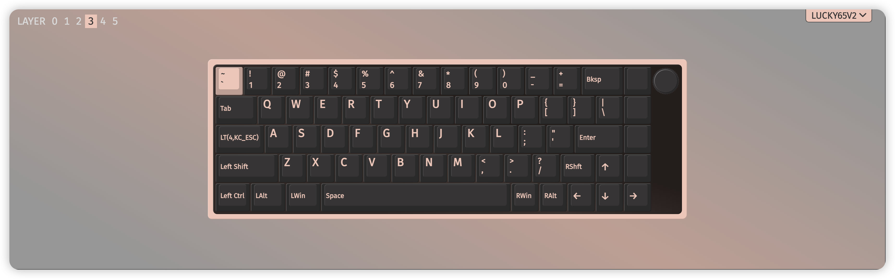

# 1. Configs
一些有趣的配置

- [1. Configs](#1-configs)
  - [1.1. Cursor 配置](#11-cursor-配置)
  - [1.2. 键盘按键布局](#12-键盘按键布局)
  - [1.3. Linux 教程](#13-linux-教程)
  - [1.4. Mac 配置](#14-mac-配置)
  - [1.5. 服务器配置](#15-服务器配置)
  - [1.6. 安装 Ubuntu Server](#16-安装-ubuntu-server)
  - [1.7. .gitignore](#17-gitignore)
- [2. 常见占位符](#2-常见占位符)

## 1.1. Cursor 配置
> cursor

关于 Cursor 的配置

## 1.2. 键盘按键布局
> keyboard

使用 [Via](https://usevia.app/) 把 `Caps` 键改为短按表示 `Esc` 长按表示 `Fn`，然后设置大量 `Fn` 组合键， \
同时交换 `;` 和 `/`，用 `:` 和 `"` 覆盖 `;` 和 `'`，从而提高码字效率
> 关于键盘是否支持 Via，可以询问商家 \
> 我使用的是唯咖（weikav）Lucky65 V2，支持 Via，但无线传输有 bug，复杂 Via 操作必须在有线连接下执行

_示例_
- Fn + H/J/K/L -> Left/Down/Up/Right
- Fn + N/M -> Home/End
- Fn + F/B -> Pagedown/Pageup
- Fn + D -> Backspace
- Fn + I/O/P -> ()/[]/{}
  > 使用宏来实现，按一下按键输出左右括号并把光标移动到括号中间
- Fn + ; -> Enter
- Fn + G/S/X -> +/-/*
- Fn + V -> _
- Fn + Q/W/E/R/T/Y/U -> !/@/#/$/%/^/&

## 1.3. Linux 教程
> linux

随手记录的知识点，为之后编写完整的教程做准备

## 1.4. Mac 配置
> mac

一些关于 Mac 的配置（待完善）

- `Homebrew`

- `zsh`
  - `oh my zsh!`
    > 万能 zsh 扩展

  - `plugins`
    > zsh 插件
    - sudo
    - z
    - history
    - copyfile
    - copypath
    - git
    - docker
    - docker-compose
    - python
    - zsh-completions
    - zsh-autosuggestions
    - zsh-syntax-highlighting
  
  - `Powerlevel10k`
    > UI

推荐一个 [Mac 教程](https://macguide.leavelet.io/index.html) （也没写完）

## 1.5. 服务器配置
> server

一个关于服务器配置的教程
- 更新系统包
- 配置非 root 用户和 ssh
- zsh
- 镜像
- Git + Github
- Cursor (VS Code)
- mini-conda
- 🪜

## 1.6. 安装 Ubuntu Server
> ubuntu_server

一个简单的教程

## 1.7. .gitignore
> .gitignore

使用 [gitignore.io](https://www.toptal.com/developers/gitignore) 生成的 `.gitignore` 文件

- 操作系统：Linux, MacOS
- 编程语言：Python
- IDE：Cursor (VS Code)
- test.py

---

# 2. 常见占位符
> 由于不同电脑不同版本的配置不一样，所以教程中一般会使用一些 `占位符`，意思是这个地方需要填代码，但是具体填什么需要依据实际情况作更改

> 例如，`username` 表示用户名，不同人的用户名不一样，在执行代码时需要用实际的用户名替换 `username`

- `username` ：用户名
- `device` `hostname` 等：设备名
- `server_ip` 等：设备 IP
- `your/path/to/sth` ：通往某处的路径
- `file` `path/to/file` ：文件
- `bash` `.bashrc` ：使用的 shell 及其配置文件。大部分 Linux 默认用 bash，如果你使用其他 shell，记得替换
- `nano` `vim` `code` `cursor` ：打开文件的文本编辑器，它们是具体的可以执行的程序，你可以依据自己的喜好选一个，由于我个人常用 `Cursor` 所以我的教程中一般使用 `cursor`

如果在教程中遇到这些占位符，需要依据自己的实际情况替换