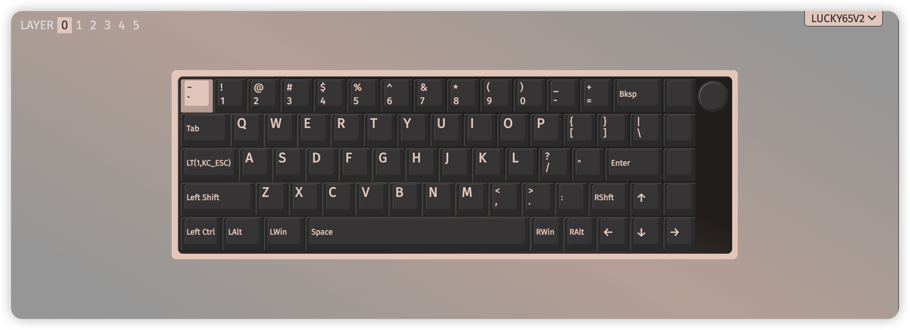

# Configs
我的常用设置

## .gitignore
使用 [gitignore.io](https://www.toptal.com/developers/gitignore) 生成的 `.gitignore` 文件

- 操作系统：MacOS
- IDE：VS Code
- 编程语言：Python

## 键盘按键布局
使用 [Via](https://usevia.app/) 把 `Caps` 键改为短按表示 `Esc` 长按表示 `Fn`，然后设置大量 `Fn` 组合键，从而提高码字效率
> 关于键盘是否支持 Via，可以询问商家 \
> 我使用的是唯咖（weikav）Lucky65 V2，支持 Via，但无线传输有 bug，复杂 Via 操作必须在有线连接下执行

- Fn + H/J/K/L -> Left/Down/Up/Right
- Fn + F/B -> Pagedown/Pageup
- Fn + D/X -> Backspace/Delete
- Fn + I/O/P -> ()/[]/{}
  > 使用宏来实现，按一下按键输出左右括号并把光标移动到括号中间
- Fn + ; -> Enter
- Fn + G -> _
- Fn + V -> =
- Fn + N/M/</> -> //-/+/*
- Fn + Q/W/E/R/T/Y/U -> !/@/#/$/%/^/&
- Fn + S -> ?
- Fn + C -> "